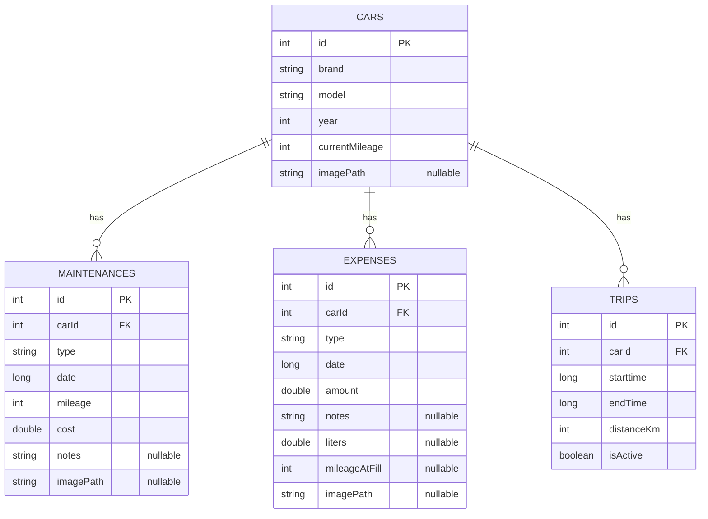
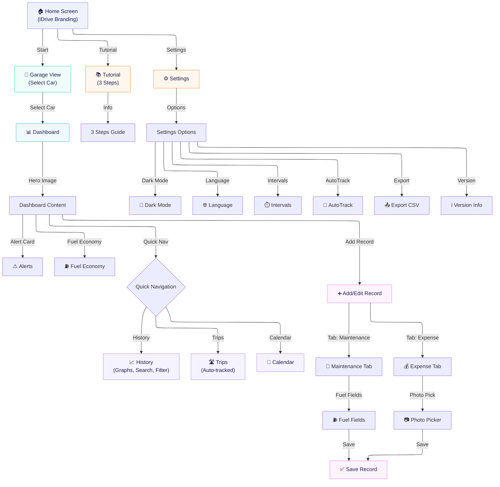

# iDrive

**แอปพลิเคชัน Android สำหรับบริหารจัดการรถยนต์ส่วนตัวอย่างครบวงจร**
ตั้งแต่การบันทึกค่าใช้จ่าย การดูแลรักษา ระบบแจ้งเตือนพยากรณ์ การจับระยะทางอัตโนมัติ ไปจนถึงกราฟวิเคราะห์ค่าใช้จ่ายและการส่งออกข้อมูล

---

## เกี่ยวกับโปรเจ็ค

**iDrive** คือแอปพลิเคชัน Android ที่ช่วยให้ผู้ใช้สามารถบริหารจัดการรถยนต์ส่วนตัวได้อย่างมีประสิทธิภาพ ไม่ว่าจะเป็นการบันทึกข้อมูลการบำรุงรักษา (เปลี่ยนน้ำมันเครื่อง, ผ้าเบรก, ยาง, แบตเตอรี่) การบันทึกค่าใช้จ่ายทั่วไป (ค่าน้ำมัน, ค่าทางด่วน, ค่าที่จอดรถ) รวมถึง **ระบบ Predictive Alert** ที่จะวิเคราะห์เลขไมล์สะสมและจำนวนวันเพื่อแจ้งเตือนผู้ใช้ล่วงหน้าว่าถึงเวลาเข้าศูนย์บริการ

แอปรองรับ **Activity Recognition API** สำหรับจับระยะทางอัตโนมัติ, **Notification ผ่าน WorkManager**, **กราฟสรุปค่าใช้จ่าย**, **ปฏิทินดูแลรักษา**, **อัตราสิ้นเปลืองน้ำมัน (km/L)**, และ **ส่งออกข้อมูลเป็น CSV**

แอปนี้ถูกพัฒนาด้วย **Kotlin** และ **Jetpack Compose** ตามแนวทาง Modern Android Development อย่างเต็มรูปแบบ (ไม่ใช้ XML Layout เลยแม้แต่หน้าเดียว)

---

## ฟีเจอร์หลัก (Features)

### การจัดการรถยนต์ (Car Management)
- เพิ่มรถยนต์ได้หลายคัน พร้อมข้อมูลยี่ห้อ, รุ่น, ปีจดทะเบียน, เลขไมล์ปัจจุบัน
- อัปโหลดรูปภาพรถจากอุปกรณ์ผ่าน Photo Picker API หรือแนบ URL รูปภาพ
- ระบบ Garage View แสดงรายการรถทั้งหมดในรูปแบบ Card พร้อมรูปภาพ Hero
- ลบรถยนต์ (พร้อมลบข้อมูลที่เกี่ยวข้องทั้งหมดอัตโนมัติ ด้วย CASCADE Delete)

### บันทึกการดูแลรักษา (Maintenance Tracking)
- เลือกประเภทการบำรุงรักษา: น้ำมันเครื่อง, ผ้าเบรก, ยาง, แบตเตอรี่, อื่นๆ
- บันทึกเลขไมล์ ณ วันที่เข้าเช็ค, ราคาค่าบริการ, และวันที่
- ใช้ Material 3 DatePicker สำหรับเลือกวันที่ (ไม่อนุญาตเลือกวันในอนาคต)
- แนบรูปภาพใบเสร็จหรือสภาพรถได้ผ่าน Photo Picker

### บันทึกค่าใช้จ่าย (Expense Tracking)
- เลือกหมวดหมู่ค่าใช้จ่าย: ค่าน้ำมัน, ค่าทางด่วน, ค่าที่จอดรถ, อื่นๆ
- บันทึกจำนวนเงิน, วันที่, และบันทึกเพิ่มเติม
- Fuel Economy: เมื่อเลือก "ค่าน้ำมัน" สามารถกรอกจำนวนลิตรและเลขไมล์ตอนเติม เพื่อคำนวณอัตราสิ้นเปลือง (km/L)
- รองรับ Undo เลิกทำหลังบันทึกผ่าน Snackbar

### Dashboard อัจฉริยะ
- แสดง Hero Image Card ของรถพร้อมชื่อยี่ห้อ รุ่น และเลขไมล์สะสม
- สรุปค่าใช้จ่ายรายเดือนและรายปี
- แสดง 5 รายการธุรกรรมล่าสุด (Maintenance และ Expense)
- Fuel Economy Card: แสดงอัตราสิ้นเปลืองเฉลี่ยและล่าสุด (km/L)
- ปุ่มลัดเข้าสู่ History, Trips และ Calendar ได้ทันที
- สลับดูรถคันอื่นได้ง่ายผ่านระบบ Garage

### Predictive Alert — ระบบแจ้งเตือนพยากรณ์
- วิเคราะห์ระยะทางที่วิ่งและจำนวนวันตั้งแต่เปลี่ยนน้ำมันเครื่องครั้งล่าสุด
- รองรับรอบ Maintenance แบบ Custom (ตั้งค่าได้ใน Settings)
- แจ้งเตือน 3 ระดับด้วยระบบสี:
  - GOOD: สภาพดี พร้อมลุยทุกเส้นทาง
  - WARNING: ใกล้ถึงระยะเช็คหรือเปลี่ยนถ่ายน้ำมันแล้ว
  - DANGER: เกินกำหนดระยะบำรุงรักษาแล้ว
- Push Notification: แจ้งเตือนอัตโนมัติทุก 24 ชั่วโมงผ่าน WorkManager

### ประวัติ (History Screen)
- ดูประวัติ Maintenance และ Expense ทั้งหมดในหน้าจอเดียว
- กราฟแท่งสรุปค่าใช้จ่าย 6 เดือนย้อนหลัง (แยกสีชัดเจน)
- ค้นหารายการจากบันทึกช่วยจำ (notes) หรือประเภท
- กรองข้อมูลตามประเภทได้
- สามารถกดเพื่อแก้ไขหรือลบรายการได้

### บันทึกการเดินทางอัตโนมัติ (Trip Tracking)
- ใช้ Activity Recognition API ตรวจจับเมื่อผู้ใช้อยู่ในรถ (IN_VEHICLE)
- จับ GPS Location ด้วย Foreground Service เพื่อคำนวณระยะทาง
- แสดงประวัติ Trips พร้อมระยะทาง, ระยะเวลา, และวันที่
- อัปเดตเลขไมล์ของรถอัตโนมัติเมื่อสิ้นสุด Trip

### ปฏิทิน (Calendar View)
- ปฏิทินแบบ Monthly Navigation พร้อมจุดสีบนวันที่มีเหตุการณ์
- ไฮไลท์วันปัจจุบันและแสดงคำอธิบายสัญลักษณ์ (Legend)

### ตั้งค่าแอปพลิเคชัน (Settings)
- Dark Mode: สลับธีมสว่างและมืดได้แบบ Real-time (บันทึกค่าผ่าน DataStore)
- Multi-language: รองรับ 2 ภาษา (ไทย และ English)
- การตั้งค่ารอบ Maintenance (กม. และ จำนวนวัน)
- เปิด/ปิดการจับระยะทางอัตโนมัติ (Auto-Track)
- ส่งออกข้อมูลทั้งหมดเป็นไฟล์ CSV
- แสดงข้อมูลเวอร์ชันแอป

### แชร์ข้อมูล (Share)
- สร้างข้อความสรุปประวัติรถและค่าใช้จ่ายรวม
- แชร์ผ่าน LINE, Messenger, Email หรือแอปอื่นๆ ได้ทันที

### Tutorial ในแอป
- หน้าสอนการใช้งาน 3 ขั้นตอน ให้ผู้ใช้ใหม่เรียนรู้ได้ง่าย

---

## Tech Stack

| เทคโนโลยี | รายละเอียด |
|---|---|
| **Language** | Kotlin |
| **UI Framework** | Jetpack Compose (Material Design 3) |
| **Architecture** | MVVM (Model-View-ViewModel) |
| **Local Database** | Room Database (SQLite) |
| **Preferences** | DataStore Preferences |
| **Image Loading** | Coil Compose |
| **Photo Picker** | AndroidX Activity Result (PickVisualMedia) |
| **Navigation** | Navigation Compose |
| **Async** | Kotlin Coroutines + Flow |
| **Background Worker** | WorkManager (Periodic Maintenance Check) |
| **Activity Recognition** | Google Play Services Location |
| **Charts** | Compose Canvas (Custom Bar Chart) |
| **Build Tool** | Gradle Kotlin DSL (KTS) |
| **Annotation Processing** | KSP (Kotlin Symbol Processing) |
| **Min/Target SDK** | API 36 |

---

## Project Architecture

โปรเจ็คนี้ใช้สถาปัตยกรรม **MVVM (Model-View-ViewModel)** แยก Layer อย่างชัดเจน:

```
com.example.project_app
├── MainActivity.kt
│
├── data/                               # -- Data Layer --
│   ├── local/
│   │   ├── CarDatabase.kt              # Room Database v2 (Singleton)
│   │   ├── CarDao.kt, MaintenanceDao.kt, ExpenseDao.kt, TripDao.kt
│   │   ├── SettingsDataStore.kt        # DataStore Preferences
│   │   └── entity/                     # Entities (Car, Maintenance, Expense, Trip)
│   │
│   ├── service/
│   │   ├── ActivityRecognitionReceiver.kt
│   │   └── TripTrackingService.kt      # Foreground Service
│   │
│   ├── worker/
│   │   └── MaintenanceCheckWorker.kt   # WorkManager Notification
│   │
│   └── export/
│       ├── CsvExporter.kt              # CSV Export
│       └── ShareHelper.kt              # Share Intent
│
└── ui/                                 # -- Presentation Layer --
    ├── navigation/
    │   ├── AppNavigation.kt            # NavHost
    │   └── AppViewModelFactory.kt
    │
    ├── screens/
    │   ├── home/           # MainHomeScreen, DashboardScreen, ViewModel
    │   ├── add_car/        # AddCarScreen, ViewModel
    │   ├── add_record/     # AddRecordScreen, ViewModel
    │   ├── history/        # HistoryScreen, ViewModel
    │   ├── trips/          # TripScreen, ViewModel
    │   ├── calendar/       # CalendarScreen, ViewModel
    │   ├── settings/       # SettingsScreen, ViewModel
    │   └── tutorial/       # TutorialScreen
    │
    └── theme/
        ├── Color.kt        # Color Palette: "Sporty Premium"
        ├── Theme.kt        # Material 3 Theme (Light/Dark)
        └── Type.kt         # Typography
```

---

## Design Concept — "Sporty Premium"

ธีมสีของแอปได้รับแรงบันดาลใจจากรถสปอร์ตระดับพรีเมียม:

| สี | ชื่อ | Hex | การใช้งาน |
|---|---|---|---|
| Racing Red | `#E63946` | Primary — ให้ความรู้สึกมีพลัง ทันสมัย |
| Carbon Navy | `#1D3557` | Secondary — ความหรูหรา เชื่อถือได้ |
| Engine Amber | `#FFB703` | Warning — สีส้มหน้าปัดรถ |
| Safe Green | `#2A9D8F` | Success — บ่งบอกความปลอดภัย |
| Pearl White | `#F8F9FA` | Background (Light Mode) |
| Matte Carbon | `#121212` | Background (Dark Mode) |

---

## Database Schema (ERD)



> ใช้ **Foreign Key** ผูกความสัมพันธ์ `carId` กับ `cars.id` และตั้ง **ON DELETE CASCADE** เพื่อให้ข้อมูลที่เกี่ยวข้องถูกลบอัตโนมัติเมื่อลบรถ

---

## วิธีติดตั้งและรันโปรเจ็ค

### Prerequisites
- **Android Studio** Ladybug (2024.2+) หรือใหม่กว่า
- **JDK 11** ขึ้นไป
- **Android SDK** API Level 36
- **Google Play Services** (สำหรับ Activity Recognition — ใช้ได้บน Physical Device เท่านั้น)

### ขั้นตอน

```bash
# 1. Clone Repository
git clone https://github.com/<your-username>/CP213_176_LearnAndroid.git

# 2. เปิดโฟลเดอร์ Project_App ด้วย Android Studio

# 3. Sync Gradle แล้วรอให้ดาวน์โหลด Dependencies เสร็จ

# 4. เลือก Device/Emulator (API 36+) แล้วกด Run
```

### Permissions ที่แอปต้องใช้
| Permission | วัตถุประสงค์ |
|---|---|
| `INTERNET` | โหลดรูปภาพจาก URL |
| `POST_NOTIFICATIONS` | ส่ง Push Notification แจ้งเตือนบำรุงรักษา |
| `ACTIVITY_RECOGNITION` | ตรวจจับการขับรถ (IN_VEHICLE) |
| `ACCESS_FINE_LOCATION` | จับ GPS ระหว่างขับเพื่อคำนวณระยะทาง |
| `ACCESS_COARSE_LOCATION` | Location Approximate |
| `FOREGROUND_SERVICE` | รัน Trip Tracking Service |
| `FOREGROUND_SERVICE_LOCATION` | ใช้ GPS ใน Foreground Service |

---

## Wireframe / App Flow

[คลิกเพื่อดู Wireframe การออกแบบแอปบน Figma (AI Generated)](https://www.figma.com/make/Y4TiGHUkDXxkPVDzhKaipi/%E0%B8%AA%E0%B8%A3%E0%B9%89%E0%B8%B2%E0%B8%87-Wireframe-%E0%B9%81%E0%B8%AD%E0%B8%9B-Android?t=PbRGAL5cuc74Za5c-1)

แม้ว่าในแบบร่าง Figma (AI Generated) เบื้องต้นอาจจะแสดงเพียงบางส่วน แต่ **ระบบจริงของแอปพลิเคชัน iDrive มีการทำงานที่ครบถ้วน โดยสามารถแบ่งกลุ่มออกเป็น 6 User Flows หลัก (รวมกว่า 15 Micro-flows)** ดังนี้:

### 1. Onboarding & Setup Flow (ระบบเริ่มต้นใช้งาน)
- **Tutorial Flow**: การแสดงหน้าแนะนำการใช้งานแอปพลิเคชัน 3 ขั้นตอนสำหรับผู้ใช้ใหม่
- **Settings Flow**: การตั้งค่าแอปพลิเคชัน (ปรับ Dark Mode, เปลี่ยนภาษา ไทย/English, ตั้งค่ารอบระยะการแจ้งเตือน)

### 2. Car Management Flow (ระบบจัดการรถยนต์)
- **Add Car Flow**: หน้า Welcome -> Garage View -> กรอกข้อมูลรถยนต์และเลขไมล์เริ่มต้น -> แนบรูปภาพ -> บันทึก
- **Edit/Delete Car Flow**: การแก้ไขข้อมูลรถยนต์ หรือลบรถยนต์ (ลบข้อมูลที่เกี่ยวข้องทั้งหมดอัตโนมัติด้วยเงื่อนไข CASCADE)
- **Switch Car Flow**: การกดสลับดูข้อมูลและประวัติของรถแต่ละคันอย่างรวดเร็วผ่านหน้า Garage

### 3. Record & Tracking Flow (ระบบบันทึกค่าใช้จ่ายและบำรุงรักษา)
- **Maintenance Flow**: หน้า Dashboard -> Add Record -> เลือกประเภทซ่อมบำรุง -> กรอกราคา, เลขไมล์, แนบรูปภาพใบเสร็จ
- **Expense & Fuel Flow**: บันทึกค่าใช้จ่าย (ค่าน้ำมัน, ค่าทางด่วน) พร้อมระบบคำนวณอัตราสิ้นเปลืองน้ำมัน (km/L) อัตโนมัติเมื่อกรอกจำนวนลิตร
- **Edit/Delete Record Flow**: การเรียกดูรายการย้อนหลังในประวัติเพื่อทำการแก้ไขหรือลบรายการ

### 4. Analytics & History Flow (ระบบสรุปผลและดูประวัติ)
- **Dashboard Flow**: การแสดงยอดสรุปค่าใช้จ่ายแบบรายเดือนและรายปี พร้อมกราฟแท่งเปรียบเทียบ
- **History Filter/Search Flow**: การค้นหาประวัติจากคำอธิบาย หรือใช้ Filter กรองดูเฉพาะหมวดหมู่ที่ต้องการ
- **Calendar Flow**: หน้าปฏิทินแสดงจุดสีแจ้งเตือนในวันที่มีการบันทึกข้อมูล (ดูประวัติเป็นรายเดือน)

### 5. Automation & Alert Flow (ระบบอัตโนมัติและการแจ้งเตือน)
- **Auto-Trip Tracking Flow**: ระบบ Activity Recognition ตรวจจับการเคลื่อนที่ (IN_VEHICLE) -> จับระยะทาง GPS เบื้องหลัง -> สรุปประวัติการเดินทางเมื่อสิ้นสุด
- **Predictive Alert Flow**: ระบบ WorkManager ทำงานเบื้องหลังคำนวณข้อมูลไมล์/วัน -> ส่ง Push Notification แจ้งเตือนล่วงหน้าเมื่อใกล้ถึงกำหนดเข้าศูนย์บริการ

### 6. Export & Data Sharing Flow (ระบบส่งออกและแชร์ข้อมูล)
- **CSV Export Flow**: ฟังก์ชันส่งออกฐานข้อมูลทั้งหมดมาเป็นไฟล์ .csv สำหรับเปิดใน Excel
- **Share Summary Flow**: การสร้างข้อความสรุปค่าใช้จ่ายของรถคันนั้นๆ แล้วแชร์ไปยังแอปพลิเคชันอื่น เช่น LINE, Email

**ภาพรวมการทำงานของแอป (App Flow Diagram):**



---

## สิ่งที่ได้เรียนรู้จากโปรเจ็คนี้

1. **Jetpack Compose** — สร้าง UI แบบ Declarative โดยไม่ใช้ XML Layout ทั้งโปรเจ็ค
2. **Room Database** — ออกแบบ Schema, Entity, DAO, Foreign Key, CASCADE Delete, Migration
3. **MVVM Architecture** — แยก Business Logic ออกจาก UI ด้วย ViewModel + StateFlow
4. **Kotlin Coroutines & Flow** — จัดการ Async Operations และ Reactive Data Stream
5. **Navigation Compose** — จัดการ Route และ Argument Passing ระหว่างหน้าจอ
6. **DataStore Preferences** — บันทึกค่าตั้งค่าอย่างปลอดภัย
7. **Material Design 3** — ใช้ Theme System, Dynamic Color Scheme, FilterChip, DatePicker
8. **Localization (i18n)** — รองรับหลายภาษาด้วย `values/strings.xml`
9. **Coil** — โหลดรูปภาพแบบ Async ใน Compose
10. **Photo Picker API** — เลือกรูปภาพจากอุปกรณ์อย่างปลอดภัย พร้อม Persistable URI Permission
11. **WorkManager** — ตรวจสอบ Maintenance ทุก 24 ชม. และส่ง Push Notification
12. **Activity Recognition API** — ตรวจจับ IN_VEHICLE / STILL จาก Google Play Services
13. **Foreground Service** — จับ GPS Location ระหว่างขับรถด้วย FusedLocationProvider
14. **Canvas Drawing** — วาดกราฟแท่งด้วย Compose Canvas
15. **CSV Export** — สร้างไฟล์ CSV ด้วย Intent.ACTION_CREATE_DOCUMENT
16. **Intent Sharing** — แชร์ข้อมูลรถผ่าน Share Sheet
