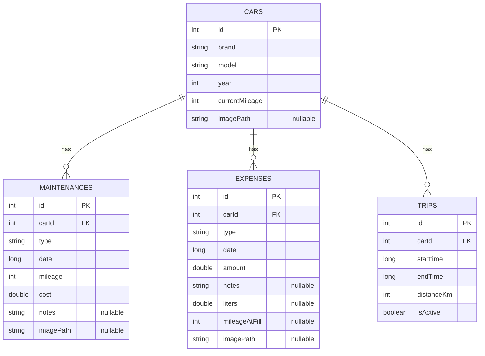
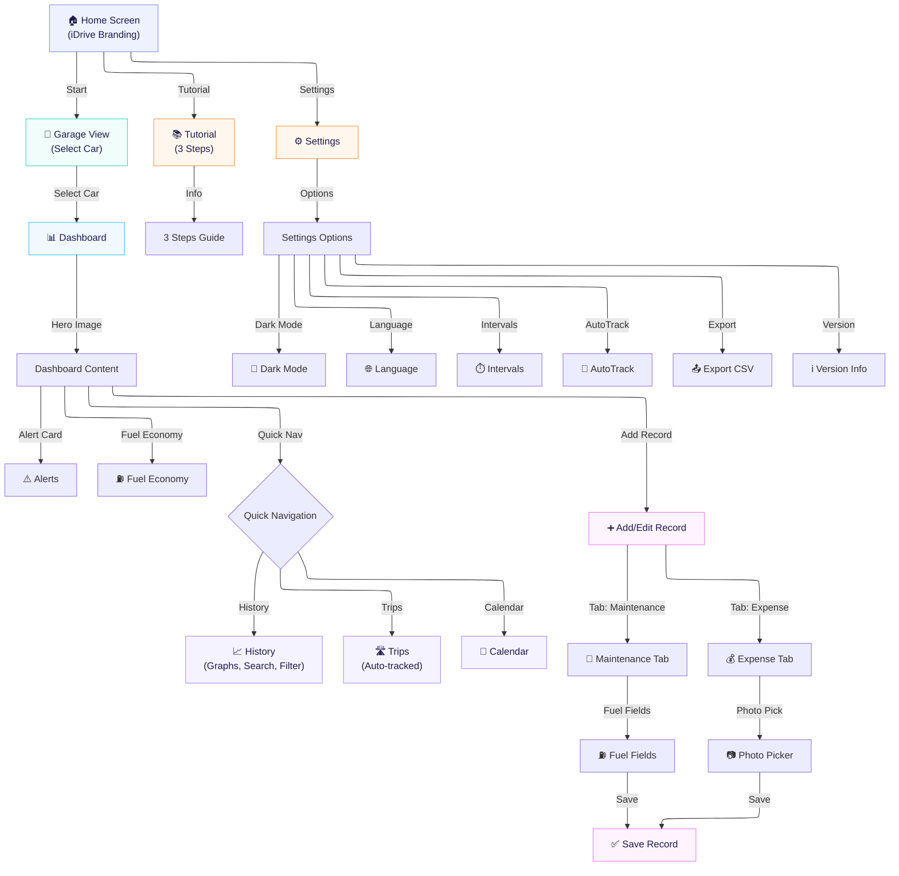

<h1 align="center">iDrive</h1>


**แอปพลิเคชัน Android สำหรับบริหารจัดการรถยนต์ส่วนตัวอย่างครบวงจร**
ตั้งแต่การบันทึกค่าใช้จ่าย การดูแลรักษา ระบบแจ้งเตือนพยากรณ์ การจับระยะทางอัตโนมัติ ไปจนถึงกราฟวิเคราะห์ค่าใช้จ่ายและการส่งออกข้อมูล

---

## เกี่ยวกับโปรเจกต์ (About The Project)

**iDrive** คือแอปพลิเคชัน Android ที่ช่วยให้ผู้ใช้สามารถบริหารจัดการรถยนต์ส่วนตัวได้อย่างมีประสิทธิภาพ ไม่ว่าจะเป็นการบันทึกข้อมูลการบำรุงรักษา (เปลี่ยนน้ำมันเครื่อง, ผ้าเบรก, ยาง, แบตเตอรี่) การบันทึกค่าใช้จ่ายทั่วไป (ค่าน้ำมัน, ค่าทางด่วน, ค่าที่จอดรถ) รวมถึง **ระบบ Predictive Alert** ที่จะวิเคราะห์เลขไมล์สะสมและจำนวนวันเพื่อแจ้งเตือนผู้ใช้ล่วงหน้าว่าถึงเวลาเข้าศูนย์บริการ

แอปพลิเคชันนี้รองรับ **Activity Recognition API** สำหรับจับระยะทางอัตโนมัติ, **Notification ผ่าน WorkManager**, **กราฟสรุปค่าใช้จ่าย**, **ปฏิทินดูแลรักษา**, **อัตราสิ้นเปลืองน้ำมัน (km/L)**, และ **ส่งออกข้อมูลเป็น CSV**

*พัฒนาด้วย **Kotlin** และ **Jetpack Compose** ตามแนวทาง Modern Android Development อย่างเต็มรูปแบบ (ไม่ใช้ XML Layout สำหรับ UI เลยแม้แต่หน้าเดียว)*

---

## ฟีเจอร์หลัก (Key Features)

### การจัดการรถยนต์ (Car Management)
- เพิ่มรถยนต์ได้หลายคัน พร้อมข้อมูลยี่ห้อ รุ่น ปีจดทะเบียน เลขไมล์ปัจจุบัน
- อัปโหลดรูปภาพรถจากอุปกรณ์ผ่าน Photo Picker API หรือแนบ URL รูปภาพ
- ระบบ Garage View แสดงรายการรถทั้งหมดในรูปแบบ Card พร้อมรูปภาพ Hero
- ลบรถยนต์ (พร้อมลบข้อมูลที่เกี่ยวข้องทั้งหมดอัตโนมัติ ด้วย CASCADE Delete)

### บันทึกการดูแลรักษา (Maintenance Tracking)
- เลือกประเภทการบำรุงรักษา: น้ำมันเครื่อง, ผ้าเบรก, ยาง, แบตเตอรี่, อื่นๆ
- บันทึกเลขไมล์ ณ วันที่เข้าเช็ค, ราคาค่าบริการ, และวันที่
- ใช้ Material 3 DatePicker สำหรับเลือกวันที่ (ไม่อนุญาตเลือกวันในอนาคต)
- แนบรูปภาพใบเสร็จหรือสภาพรถได้ผ่าน Photo Picker

### บันทึกค่าใช้จ่าย (Expense Tracking)
- เลือกหมวดหมู่ค่าใช้จ่าย: ค่าน้ำมัน, ค่าทางด่วน, ค่าที่จอดรถ, อื่นๆ
- บันทึกจำนวนเงิน, วันที่, และบันทึกเพิ่มเติม
- **Fuel Economy:** เมื่อเลือก "ค่าน้ำมัน" สามารถกรอกจำนวนลิตรและเลขไมล์ตอนเติม เพื่อคำนวณอัตราสิ้นเปลือง (km/L)
- รองรับ Undo เลิกทำหลังบันทึกผ่าน Snackbar

### Dashboard อัจฉริยะ
- แสดง Hero Image Card ของรถพร้อมชื่อยี่ห้อ รุ่น และเลขไมล์สะสม
- สรุปค่าใช้จ่ายรายเดือนและรายปี พร้อม 5 รายการธุรกรรมล่าสุด
- Fuel Economy Card: แสดงอัตราสิ้นเปลืองเฉลี่ยและล่าสุด (km/L)
- ปุ่มลัดเข้าสู่ History, Trips และ Calendar ได้ทันที

### Predictive Alert — ระบบแจ้งเตือนพยากรณ์
- วิเคราะห์ระยะทางที่วิ่งและจำนวนวันตั้งแต่เปลี่ยนน้ำมันเครื่องครั้งล่าสุด
- แจ้งเตือน 3 ระดับด้วยระบบสี: 🟢 GOOD, 🟠 WARNING, 🔴 DANGER
- **Push Notification:** แจ้งเตือนอัตโนมัติทุก 24 ชั่วโมงผ่าน WorkManager

### การเดินทางอัตโนมัติ (Trip Tracking) & ฟีเจอร์อื่นๆ
- **Auto-Trip Tracking:** ใช้ Activity Recognition API ตรวจจับการขับรถ และ Foreground Service จับ GPS
- **History & Calendar:** ดูกราฟแท่ง ค้นหาประวัติ และดูปฏิทินบันทึกการซ่อมบำรุง
- **Settings:** รองรับ Dark Mode, Multi-language (ไทย/Eng), ตั้งค่าระยะ Maintenance แจ้งเตือน
- **Export & Share:** ส่งออกข้อมูลเป็น CSV และแชร์สรุปค่าใช้จ่ายผ่านแอปอื่น

---

## เทคโนโลยีที่ใช้ (Tech Stack)

| หมวดหมู่ | เทคโนโลยี / ไลบรารี |
|---|---|
| **ภาษาหลัก (Language)** | Kotlin |
| **UI Framework** | Jetpack Compose (Material Design 3) |
| **สถาปัตยกรรม (Architecture)** | MVVM (Model-View-ViewModel) |
| **ฐานข้อมูล (Database)** | Room Database (SQLite) |
| **การเก็บตั้งค่า (Preferences)** | DataStore Preferences |
| **จัดการรูปภาพ (Image Loading)** | Coil Compose |
| **Photo Picker** | AndroidX Activity Result (PickVisualMedia) |
| **การนำทาง (Navigation)** | Navigation Compose |
| **การทำงานแบบ Asynchronous** | Kotlin Coroutines + Flow |
| **Background Worker** | WorkManager (Periodic Maintenance Check) |
| **Activity Recognition** | Google Play Services Location |
| **วาดกราฟ (Charts)** | Compose Canvas (Custom Bar Chart) |
| **Build Tool** | Gradle Kotlin DSL (KTS) |
| **SDK Version** | Min/Target SDK: API 36 |

---

## การออกแบบ (Design Concept) — "Sporty Premium"

ธีมสีของแอปได้รับแรงบันดาลใจจากรถสปอร์ตระดับพรีเมียม:

| สี | ชื่อ (Name) | Hex Code | ความหมาย / การใช้งาน |
|---|---|---|---|
| 🔴 | Racing Red | `#E63946` | Primary — ให้ความรู้สึกมีพลัง ทันสมัย |
| 🔵 | Carbon Navy | `#1D3557` | Secondary — ความหรูหรา เชื่อถือได้ |
| 🟠 | Engine Amber| `#FFB703` | Warning — สีส้มบนหน้าปัดรถ |
| 🟢 | Safe Green | `#2A9D8F` | Success — บ่งบอกความปลอดภัย |
| ⚪ | Pearl White | `#F8F9FA` | Background (Light Mode) |
| ⚫ | Matte Carbon| `#121212` | Background (Dark Mode) |

---

## โครงสร้างโปรเจกต์ (Project Architecture)

โปรเจกต์นี้ใช้สถาปัตยกรรม **MVVM (Model-View-ViewModel)** โดยแบ่ง Layer ออกจากกันอย่างชัดเจน:

<details>
<summary><b>คลิกเพื่อดูโครงสร้างโฟลเดอร์</b></summary>

```text
com.example.project_app
├── MainActivity.kt
│
├── data/                               # -- Data Layer --
│   ├── local/
│   │   ├── CarDatabase.kt              # Room Database v2 (Singleton)
│   │   ├── CarDao.kt, MaintenanceDao.kt, ExpenseDao.kt, TripDao.kt
│   │   ├── SettingsDataStore.kt        # DataStore Preferences
│   │   └── entity/                     # Entities (Car, Maintenance, Expense, Trip)
│   │
│   ├── service/
│   │   ├── ActivityRecognitionReceiver.kt
│   │   └── TripTrackingService.kt      # Foreground Service
│   │
│   ├── worker/
│   │   └── MaintenanceCheckWorker.kt   # WorkManager Notification
│   │
│   └── export/
│       ├── CsvExporter.kt              # CSV Export
│       └── ShareHelper.kt              # Share Intent
│
└── ui/                                 # -- Presentation Layer --
    ├── navigation/
    │   ├── AppNavigation.kt            # NavHost
    │   └── AppViewModelFactory.kt
    │
    ├── screens/
    │   ├── home/, add_car/, add_record/, history/, trips/, calendar/, settings/, tutorial/
    │
    └── theme/
        ├── Color.kt, Theme.kt, Type.kt # Material 3 Theme & Typography
```
</details>

---

## Database Schema (ERD)

<details>
<summary><b>คลิกเพื่อดูแผนภาพ ERD</b></summary>


*มีการใช้ **Foreign Key** `carId` เชื่อมกับตาราง `CARS` พร้อมเปิดใช้งาน **ON DELETE CASCADE** เพื่อความสมบูรณ์ของข้อมูล*
</details>

---

## App Flow Diagram

[คลิกเพื่อดู Wireframe บน Figma](https://www.figma.com/make/Y4TiGHUkDXxkPVDzhKaipi/%E0%B8%AA%E0%B8%A3%E0%B9%89%E0%B8%B2%E0%B8%87-Wireframe-%E0%B9%81%E0%B8%AD%E0%B8%9B-Android?t=PbRGAL5cuc74Za5c-1)

แอปพลิเคชันถูกออกแบบออกเป็น 6 User Flows หลัก (มากกว่า 15 Micro-flows):

<details>
<summary><b>คลิกเพื่อดูแผนภาพการไหลของแอป (Flow Diagram)</b></summary>


</details>

---

## วิธีการติดตั้งและใช้งาน (Installation)

### Prerequisites
- **Android Studio** Ladybug (2024.2+) หรือใหม่กว่า
- **JDK 11** ขึ้นไป
- **Android SDK** API Level 36
- Physical Device (สำหรับฟีเจอร์ Activity Recognition)

### ขั้นตอนการรันโปรเจกต์
```bash
# 1. Clone Repository นี้ลงบนเครื่องของคุณ
git clone https://github.com/<your-username>/CP213_176_LearnAndroid.git

# 2. เปิด Android Studio แล้วเลือก Open ไปที่โฟลเดอร์ Project_App

# 3. รอให้ Gradle Sync และดาวน์โหลด Dependencies เสร็จสิ้น

# 4. เลือก Device หรือ Emulator และกด Run (▶️)
```

<details>
<summary><b>สิทธิ์การใช้งานแอป (Permissions)</b></summary>

| Permission | วัตถุประสงค์ |
|---|---|
| `INTERNET` | โหลดรูปภาพจาก URL |
| `POST_NOTIFICATIONS` | แจ้งเตือนบำรุงรักษารถประจำวัน |
| `ACTIVITY_RECOGNITION` | ตรวจจับการเคลื่อนที่ (IN_VEHICLE) อัตโนมัติ |
| `ACCESS_FINE_LOCATION` | ประมวลผลระยะทางผ่าน GPS |
| `ACCESS_COARSE_LOCATION` | ระบบตำแหน่งที่ตั้งโดยประมาณ |
| `FOREGROUND_SERVICE` | ให้บริการ Trip Tracking ทำงานเบื้องหลังได้ |
</details>

---

## สิ่งที่ได้เรียนรู้ (Lessons Learned)
- **Jetpack Compose** (Declarative UI)
- **Room Database** (Entity, DAO, Foreign Key, Migration)
- **MVVM Architecture** (ViewModel + StateFlow)
- **Kotlin Coroutines & Flow** (Asynchronous operations)
- **Navigation Compose** (Screen Routing)
- **Material Design 3** (Dynamic Colors, Theming)
- **WorkManager & Background Services** (Periodic Tasks & Location Tracking)
