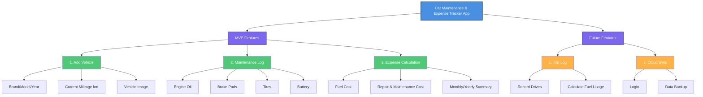

# Project Plan

# Car Maintenance App



## MVP Features

### 1. Add Vehicle
- Brand/Model/Year
- Current Mileage (km)
- Vehicle Image

### 2. Maintenance Log
- Engine Oil tracking
- Brake Pads tracking
- Tires tracking
- Battery tracking

### 3. Expense Calculation
- Fuel Cost tracking
- Repair & Maintenance Cost
- Monthly/Yearly Summary

## Future Features

### 1. Trip Log
- Record Drives
- Calculate Fuel Usage

### 2. Cloud Sync
- User Login
- Data Backup

## Screenshots
*Coming soon...*

## Tech Stack
*Add your tech stack here*

## Installation
```bash
# Add installation instructions
```

## Contributing
Contributions are welcome! Please feel free to submit a Pull Request.

## License
*Add your license here*
