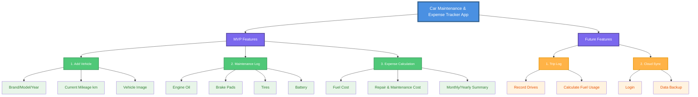

# Project Plan

```mermaid
graph TB
    A["Car Maintenance & Expense Tracker App"]
    
    A --> B["MVP Features"]
    A --> C["Future Features"]
    
    B --> B1["1. Add Vehicle"]
    B --> B2["2. Maintenance Log"]
    B --> B3["3. Expense Calculation"]
    
    B1 --> B1a["Brand/Model/Year"]
    B1 --> B1b["Current Mileage km"]
    B1 --> B1c["Vehicle Image"]
    
    B2 --> B2a["Engine Oil"]
    B2 --> B2b["Brake Pads"]
    B2 --> B2c["Tires"]
    B2 --> B2d["Battery"]
    
    B3 --> B3a["Fuel Cost"]
    B3 --> B3b["Repair & Maintenance Cost"]
    B3 --> B3c["Monthly/Yearly Summary"]
    
    C --> C1["1. Trip Log"]
    C --> C2["2. Cloud Sync"]
    
    C1 --> C1a["Record Drives"]
    C1 --> C1b["Calculate Fuel Usage"]
    
    C2 --> C2a["Login"]
    C2 --> C2b["Data Backup"]
    
    style A fill:#4A90E2,color:#fff,stroke:#2E5C8A,stroke-width:4px,font-size:18px
    style B fill:#7B68EE,color:#fff,stroke:#5A4BA1,stroke-width:3px,font-size:16px
    style C fill:#7B68EE,color:#fff,stroke:#5A4BA1,stroke-width:3px,font-size:16px
    
    style B1 fill:#50C878,color:#fff,stroke:#3A9B5C,stroke-width:2px,font-size:14px
    style B2 fill:#50C878,color:#fff,stroke:#3A9B5C,stroke-width:2px,font-size:14px
    style B3 fill:#50C878,color:#fff,stroke:#3A9B5C,stroke-width:2px,font-size:14px
    
    style C1 fill:#FFB347,color:#fff,stroke:#E69500,stroke-width:2px,font-size:14px
    style C2 fill:#FFB347,color:#fff,stroke:#E69500,stroke-width:2px,font-size:14px
    
    style B1a fill:#E8F5E9,color:#2E7D32
    style B1b fill:#E8F5E9,color:#2E7D32
    style B1c fill:#E8F5E9,color:#2E7D32
    
    style B2a fill:#E8F5E9,color:#2E7D32
    style B2b fill:#E8F5E9,color:#2E7D32
    style B2c fill:#E8F5E9,color:#2E7D32
    style B2d fill:#E8F5E9,color:#2E7D32
    
    style B3a fill:#E8F5E9,color:#2E7D32
    style B3b fill:#E8F5E9,color:#2E7D32
    style B3c fill:#E8F5E9,color:#2E7D32
    
    style C1a fill:#FFF3E0,color:#E65100
    style C1b fill:#FFF3E0,color:#E65100
    
    style C2a fill:#FFF3E0,color:#E65100
    style C2b fill:#FFF3E0,color:#E65100
```

